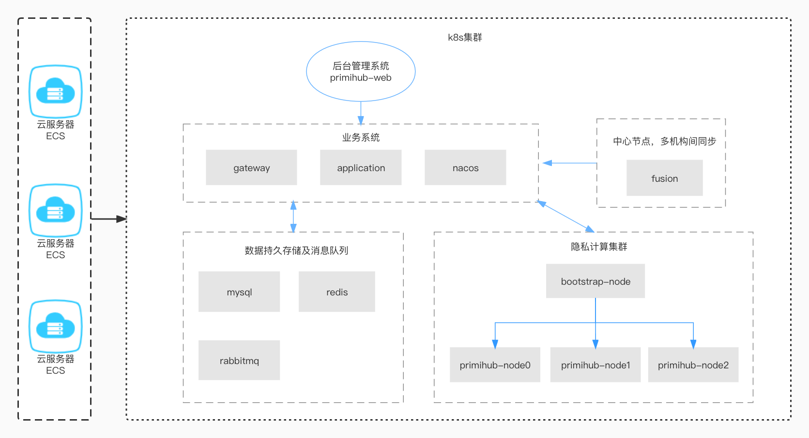

# README

### 此脚本提供 Primihub 平台一键部署功能，使用 `docker-compose` 部署请参照 [这里](./docker-deploy/README.md)，使用 `k8s` 部署请参照 [这里](./k8s-deploy/README.md)

### 特殊说明

* 部署的机器需要支持 `avx2`,`sse4_1` 指令集，可通过 `lscpu | grep avx2` 查看(不支持此指令集的机器无法运行MPC任务)

### 部署架构

